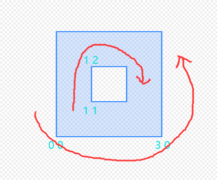
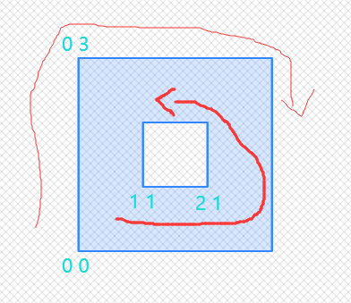
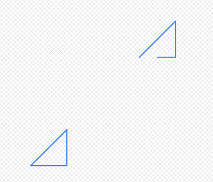
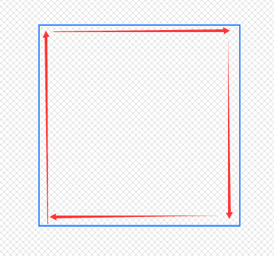
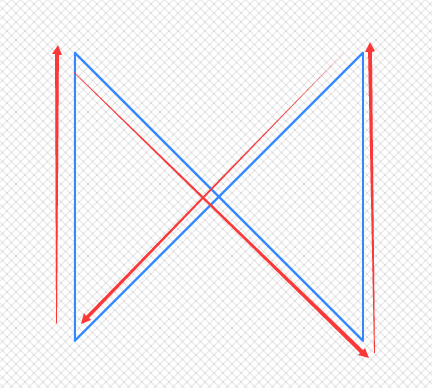
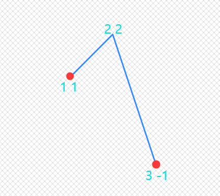
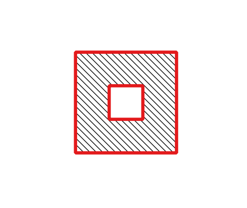
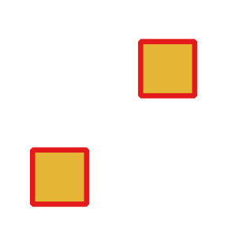
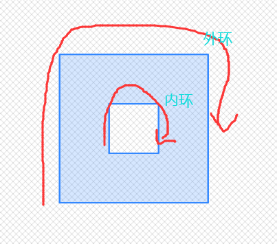
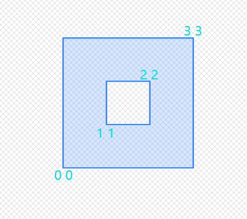

### 8.4 元数据读写

**以下函数返回图形类型和图形类型对应的坐标和拓扑维度。**

#### <span id="GeometryType">GeometryType</span>

作用：返回图形类型字符串，字符串形式是：'POINT','LINESTRING','POLYGON','MULTIPOINT','MULTILINESTRING','MULTIPOLYGON'等等。
```
SELECT GeometryType(ST_GeomFromText('Point(118 32)'));
    geometrytype
-------------------
    POINT
    
    
SELECT GeometryType(ST_GeomFromText('LineString(118 32,119 33)'));
    geometrytype
-------------------
    LINESTRING
```

#### <span id="ST_GeometryType">ST_GeometryType</span>
作用：返回图形类型SQL_MM字符串，字符串形式是：'ST_Point','ST_Linestring','ST_Polygon','ST_MultiPoint','ST_MultiLinestring','ST_MultiPolygon'等等。
```
SELECT ST_GeometryType(ST_GeomFromText('Point(118 32)'));
    st_geometrytype
-------------------
    ST_Point
    
    
SELECT ST_GeometryType(ST_GeomFromText('LineString(118 32,119 33)'));
    st_geometrytype
-------------------
    ST_Linestring
```

#### <span id="ST_CoordDim">ST_CoordDim/ST_NDims</span>

作用：两个函数一模一样，都是返回图形坐标维度，如二维返回2，xyz,xym都返回3，xyzm返回4。


坐标形式 | 维度
---|---
xy | 2
xyz | 3
xym | 3
xyzm | 4


```
--xy
SELECT ST_CoordDim(ST_GeomFromText('Point(1 2)'));
 st_coorddim
-------------
    2
--xyz
SELECT ST_CoordDim(ST_GeomFromText('PointZ(1 2 3'));
 st_coorddim
-------------
    3
--xym
SELECT ST_CoordDim(ST_GeomFromText('PointM(1 2 3'));
 st_coorddim
-------------
    3
--xyzm
SELECT ST_CoordDim(ST_GeomFromText('PointZM(1 2 2 2'));
 st_coorddim
-------------
    4
```
#### <span id='ST_Dimension'>ST_Dimension</span>
作用：返回图形的拓扑维度，拓扑维度只区分大类，如POINT形式，子形式包括MULTIPOINT,POINTZ,POINTM,POINTZM，统统都返回0，以此类推。
几何拓扑形式 | 维度
---|---
POINT | 0
LINESTRING | 1
POLYGON | 2
EMPTY | -1

```
--xy点
SELECT ST_CoordDim(ST_GeomFromText('Point(1 2)'));
 ST_Dimension
-------------
    0
--multi点
SELECT ST_CoordDim(ST_GeomFromText('MultiPoint(1 2,3 4)'));
 ST_Dimension
-------------
    0
--xyz点
SELECT ST_CoordDim(ST_GeomFromText('PointZ(1 2 3'));
 ST_Dimension
-------------
    0
--xym点
SELECT ST_CoordDim(ST_GeomFromText('PointM(1 2 3'));
 ST_Dimension
-------------
    0
--xyzm点
SELECT ST_CoordDim(ST_GeomFromText('PointZM(1 2 2 2'));
 ST_Dimension
-------------
    0
--linestring
SELECT ST_CoordDim(ST_GeomFromText('LineString(1 2,3 4)'));
 ST_Dimension
-------------
    1
--polygon
SELECT ST_CoordDim(ST_GeomFromText('Polygon((0 0,0 1,1 1,1 0,0 0))'));
 ST_Dimension
-------------
    2
```

对于类型不明确的，如GEOMETRYCOLLECTION，会选择集合里维度最高的子图形，将该子图形的图形拓扑维度返回：
```
SELECT ST_Dimension('GEOMETRYCOLLECTION(LINESTRING(1 1,0 0),POINT(0 0))');
ST_Dimension
-----------
    1

SELECT ST_Dimension('GEOMETRYCOLLECTION(Polygon((0 0,0 1,1 1,1 0,0 0)),LINESTRING(1 1,0 0),POINT(0 0))');
ST_Dimension
-----------
    2
```

####  <span id='ST_Zmflag'>ST_Zmflag</span>
作用：该函数主要用于测试一个图形的坐标究竟是带m还是带z值，根据其不同转态返回能提现zm状态的维度编码。
zm坐标形式 | 维度
---|---
xy | 0
xym | 1
xyz | 2
xyzm | 3
ST_Zmflag与ST_CoordDim,ST_NDims不同，ST_CoordDim,ST_NDims中，xyz与xym都返回3，xyzm返回4，这两个函数返回值只是表达了图形坐标是几维构成，但是同样是三维，究竟是xyz还是xym是区分不了的。而通过ST_Zmflag函数，能得到准确的图形坐标究竟是xyz还是xym形式。

```
SELECT ST_Zmflag(ST_GeomFromEWKT('LINESTRING(1 2, 3 4)'));
st_zmflag
-----------
    0
SELECT ST_Zmflag(ST_GeomFromEWKT('LINESTRINGM(1 2 0, 3 4 0)'));
st_zmflag
-----------
    1
SELECT ST_Zmflag(ST_GeomFromEWKT('LINESTRINGZ(1 2 0, 3 4 0)'));
st_zmflag
-----------
    2
SELECT ST_Zmflag(ST_GeomFromEWKT('LINESTRINGZM(1 2 0 0, 3 4 0 0)'));
st_zmflag
-----------
    3
    
    
--对比下ST_CoordDim,ST_NDims
SELECT ST_CoordDim(ST_GeomFromEWKT('LINESTRINGZ(1 2 0, 3 4 0)'));
ST_CoordDim
-----------
    3
SELECT ST_CoordDim(ST_GeomFromEWKT('LINESTRINGM(1 2 0, 3 4 0)'));
ST_CoordDim
-----------
    3
--ST_CoordDim,ST_NDims无法区分第三维究竟是z还是m。
```


**以下函数为测试函数，判别geometry某个属性是否具备某个状态**。
#### <span id='ST_HasArc'>ST_HasArc</span>

作用：该函数主要用于测试一个图形是否包含圆弧。判断依据比较勉强，仅仅判断图形或者图形集合中的子图形是不是包含圆弧标志的字符串。

下例以CIRCULARSTRING(1 1, 2 2, 3 3, 4 4, 5 5)说明，这个圆弧长什么样都不知道，但是只要用CIRCULARSTRING声明其是圆弧，就会返回true。圆弧在PostGIS中其实能构造但是其他可视化软件不认识，无法可视化。该函数使用频率其实也非常低。
```
SELECT ST_HasArc(ST_GeomFromEWKT('CIRCULARSTRING(1 1, 2 2, 3 3, 4 4, 5 5)'));
st_hasarc
--------
  true
```
#### <span id='ST_IsPolygonCCW '>ST_IsPolygonCCW </span>


作用：测试多边形是否具有逆时针方向的外环和顺时针方向的内环。


```
--外环是逆时针方向，内环是顺时针方向
select ST_IsPolygonCCW(ST_GeomFromEWKT('Polygon((0 0,3 0,3 3,0 3,0 0),(1 1,1 2,2 2,2 1,1 1))'));
ST_IsPolygonCCW
-------------------
    true
    
--外环是逆时针方向，内环也是逆时针方向
select ST_IsPolygonCCW(ST_GeomFromEWKT('Polygon((0 0,3 0,3 3,0 3,0 0),(1 1,2 1,2 2,1 2,1 1))'));
ST_IsPolygonCCW
-------------------
    false
```
#### <span id='ST_IsPolygonCW'>ST_IsPolygonCW</span>
作用：测试多边形是否具有顺时针方向的外环和逆时针方向的内环。


```
select ST_IsPolygonCW(ST_GeomFromEWKT('Polygon((0 0,0 3,3 3,3 0,0 0),(1 1,2 1,2 2,1 2,1 1))'));
ST_IsPolygonCW
-------------------
    true
```
#### <span id='ST_IsClosed'>ST_IsClosed</span>
作用：判别一个线是否闭合。Polygon一定是闭合的否则构造会出错，因此，该函数常用就是判别线。所谓闭合，就是**起点=终点** ，即首尾相连。
主要使用场景：
```
SELECT ST_IsClosed(ST_GeomFromEWKT('LINESTRING(0 0, 1 1)'));
st_isclosed
-------------
   false
SELECT ST_IsClosed(ST_GeomFromEWKT('LINESTRING(0 0, 1 1,1 0,0 0)'));
st_isclosed
-------------
   true  
```

以下场景不常用，但是该函数也支持，并且返回结果有点差异。

多义线，每个子线都是首尾相连的：


```
SELECT ST_IsClosed(ST_GeomFromEWKT('MULTILINESTRING((0 0, 1 1,1 0,0 0),(3 3,4 4,4 3,3 3))'));
st_isclosed
-------------
   true 
```

多义线，至少有个子线不是首尾相连的：


```

SELECT ST_IsClosed(ST_GeomFromEWKT('MULTILINESTRING((0 0, 1 1,1 0,0 0),(3 3,4 4,4 3,3.5 3))'));
st_isclosed
-------------
   true 
```

结论：多义线实际是计算每个子线是否闭合，只有所有子线都闭合，才返回true，任意一个子线不闭合，就会返回false。

根据闭合的概念 起点=终点 那么对于点而言，起点终点就是一个点，所以一定返回true；而多义点和多义线一样，是分别计算每个子图形是否闭合，由于MultiPoint的子图形都是Point，而Point一定返回true，那么意味着于MultiPoint的子图形都是闭合的。
```
SELECT ST_IsClosed('POINT(0 0)'::geometry);
st_isclosed
-------------
   true

SELECT ST_IsClosed('MULTIPOINT((0 0), (1 1))'::geometry);
st_isclosed
-------------
    true

```
结论：

    1 对于点，多义点，该函数总是返回true。
    2 对于线首尾相连认定闭合，多义线要保证每个子线都是闭合才认为多义线闭合。
    3 对于面，多义面，由于面一定是闭合的，因此该函数总是返回true。
    4 该函数其实仅仅用于判定LineString是否闭合为主要目的。


#### <span id='ST_IsCollection'>ST_IsCollection</span>
作用：判定一个图形是否是集合类型，集合类型列表如下：

    • GEOMETRYCOLLECTION
    • MULTI{POINT,POLYGON,LINESTRING,CURVE,SURFACE}
    • COMPOUNDCURVE
当图形类型为列表类型时，该函数返回true，否则返回false。

```
--单线
SELECT ST_IsCollection('LINESTRING(0 0, 1 1)'::geometry);
st_iscollection
-------------
    false
--多义线
SELECT ST_IsCollection('MultiLINESTRING((0 0, 1 1))'::geometry);
st_iscollection
-------------
    true    
```
#### <span id='ST_IsEmpty'>ST_IsEmpty</span>
作用：判定一个图形是否为空。
```
SELECT ST_IsEmpty(ST_GeomFromText('POLYGON EMPTY'));
st_isempty
------------
    true

SELECT ST_IsEmpty(ST_GeomFromText('POLYGON((1 2, 3 4, 5 6, 1 2))'));
st_isempty
------------
 false
```

#### <span id='ST_IsRing'>ST_IsRing</span>
作用：判定是否为“环”，图形中的换“环”其实是闭合的单线，比如Polygon就是一个个环组成的图形。对于“环”的定义应满足如下两点：
    
    1 闭合的线，则ST_IsClosed(geom)=true。
    2 该线不自相交，不自相切，则ST_IsSimple(geom)=true。


​    

```
SELECT ST_IsRing(geom), ST_IsClosed(geom), ST_IsSimple(geom)
FROM (SELECT 'LINESTRING(0 0, 0 1, 1 1, 1 0, 0 0)'::geometry AS geom) AS foo;
st_isring | st_isclosed | st_issimple
-----------+-------------+-------------
true      |   true      | true
```


```
SELECT ST_IsRing(geom), ST_IsClosed(geom), ST_IsSimple(geom)
FROM (SELECT 'LINESTRING(0 0, 0 1, 1 0, 1 1, 0 0)'::geometry AS geom) AS foo;
st_isring | st_isclosed | st_issimple
-----------+-------------+-------------
false     |  true       |  false
```
**结论：由“环”定义可知，只有当则ST_IsClosed与则ST_IsSimple两个函数都返回true，ST_IsRing(geom)才会返回true。**

#### <span id='ST_IsSimple'>ST_IsSimple</span>
作用：判定一个图形是否自相交或者自相切。
示意图见ST_IsRing中示意图。
```
SELECT ST_IsSimple('LINESTRING(0 0, 0 1, 1 1, 1 0, 0 0)'::geometry);
st_issimple
-------------
 true

SELECT ST_IsSimple('LINESTRING(0 0, 0 1, 1 0, 1 1, 0 0)'::geometry);
st_issimple
-------------
 false

```
**以上函数为测试函数，判别geometry某个属性是否具备某个状态**。


#### <span id='ST_Boundary'>ST_Boundary</span>
作用：返回图形边界，抽象，用例子说明。

1 对于点而言，图形边界都是empty：
```
SELECT ST_AsText(ST_Boundary('Point(1 1)'::geometry));
       st_astext
------------------------
GEOMETRYCOLLECTION EMPTY


SELECT ST_AsText(ST_Boundary('MultiPoint(1 1,2 2)'::geometry));
       st_astext
-------------------------
GEOMETRYCOLLECTION EMPTY
```
2 对于未闭合线而言，图形边界是其起点和终点：


```
SELECT ST_AsText(ST_Boundary('LINESTRING(1 1,2 2,3 -1)'::geometry));
       st_astext
-------------------------
 MULTIPOINT(1 1,3 -1)
 
SELECT ST_AsText(ST_Boundary('MultiLINESTRING((1 1,2 2,3 -1),(0 0,-1 -1,-2 3))'::geometry));
       st_astext
------------------------------
 MULTIPOINT(1 1,3 -1,0 0,-2 3)
```
补充：对MultiLINESTRING而言，分别计算子线的边界（起点，终点），然后把所有子线的边界（都是点）塞到一个MULTIPOINT返回。

3 对于闭合线，图形边界为空：
```
SELECT ST_AsText(ST_Boundary('LINESTRING(1 1,2 2,3 -1,1 1)'::geometry));
       st_astext
------------------------
   MULTIPOINT EMPTY
```


4 对于面而言，图形边界是其环：

单义面：


```
select ST_AsText(ST_Boundary(ST_GeomFromEWKT('Polygon((0 0,3 0,3 3,0 3,0 0),(1 1,1 2,2 2,2 1,1 1))')));
       st_astext
------------------------------------------------------------
MULTILINESTRING((0 0,3 0,3 3,0 3,0 0),(1 1,1 2,2 2,2 1,1 1))
```
多义面：



```
select ST_AsText(ST_Boundary(
	ST_GeomFromEWKT('MultiPolygon(((0 0,1 0,1 1,0 1,0 0)),((2 2,2 3,3 3,3 2,2 2)))')));
       st_astext
------------------------------------------------------------
MULTILINESTRING((0 0,1 0,1 1,0 1,0 0),(2 2,2 3,3 3,3 2,2 2))	
```

#### <span id='ST_Envelope'>ST_Envelope</span>
作用：返回一个图形的外接矩形。点的外接矩形是Point，线面的外接矩形是个长方形Polygon，**xyz的线面外接矩形仍然是xy维度里的长方形，而非官方手册说的长方体**。
```
--点
SELECT ST_AsText(ST_Envelope('POINT(1 3)'::geometry));
st_astext
------------
POINT(1 3)

--线
SELECT ST_AsText(ST_Envelope('LineString(0 0,1 1)'::geometry));
          st_astext
------------------------------
POLYGON((0 0,0 1,1 1,1 0,0 0))

--面
SELECT ST_AsText(ST_Envelope('Polygon((0 0,1 0,1 1,0 1,0 0))'::geometry));
          st_astext
------------------------------
POLYGON((0 0,0 1,1 1,1 0,0 0))

--xyz 线
SELECT ST_AsText(ST_Envelope('LineStringZ(0 0 0,1 1 1)'::geometry));
          st_astext
------------------------------
POLYGON((0 0,0 1,1 1,1 0,0 0))

--xyz面
SELECT ST_AsText(ST_Envelope('PolygonZ((0 0 0,1 0 1,1 1 1,0 1 0,0 0 0))'::geometry));
          st_astext
------------------------------
POLYGON((0 0,0 1,1 1,1 0,0 0))
```
**说明：xyz的线面返回还是二维的xy面，z轴被丢失了。**

##### ST_Envelope与Box2D
相同点：ST_Envelope与Box2D都是获取输入图形的外接矩形。

不同点：ST_Envelope返回的是个geometry对象，如'Polygon((minx miny,minx maxy,maxx maxy,maxx miny,minx miny))::geometry'；Box2D返回的是box2d对象，如BOX(minx,miny,maxx,maxy)。

#### <span id='ST_BoundingDiagonal'>ST_BoundingDiagonal</span>
作用：返回一个图形边界框构成的对角线。该函数会保留所有的srid和zm维度。

函数定义：ST_BoundingDiagonal(geometry geom, boolean fits=false)

参数说明：fits参数表示是否采用最佳拟合，在输入图形节点很多的情况下，fits=true则获取的边界框构成的对角线更精确点，但是稍慢；fits=false则获取的边界框范围稍大，但是速度更快。fits无论true或false，对角线构成的边界框都会覆盖输入图形（对角线的bbox>=输入图形的bbox）


```
--xy
SELECT ST_AsText(ST_BoundingDiagonal('Polygon((0 0,1 0,1 1,0 1,0 0))'::geometry));
        st_astext
---------------------------
   LINESTRING(0 0,1 1)

--xyz
SELECT ST_AsText(ST_BoundingDiagonal('PolygonZ((0 0 0,1 0 1,1 1 1,0 1 0,0 0 0))'::geometry));
        st_astext
---------------------------
LINESTRING Z (0 0 0,1 1 1)
```


#### <span id='ST_X'>ST_X,ST_Y,ST_Z,ST_M</span>
作用：ST_X,ST_Y,ST_Z,ST_M四个函数分别返回Point的x，y，z，m值，**入参必须是Point**。
```
SELECT ST_X(geom), ST_Y(geom), ST_Z(geom),ST_M(geom)
FROM (SELECT ST_GeomFromEWKT('POINT(1 2 3 4)') AS geom) AS foo;
st_x | st_y | st_z | st_m
--------------------------
 1   |  2   |  3   |   4
```
#### <span id='ST_StartPoint'>ST_StartPoint,ST_EndPoint</span>
作用：ST_StartPoint,ST_EndPoint分别返回LineString或CircularLineString的起点，终点，**入参必须是LineString与CircularLineString，如果是其他图形类型，返回null**。
```
SELECT ST_AsText(ST_StartPoint(geom)) startpt, ST_AsText(ST_EndPoint(geom)) endpt
FROM (SELECT ST_GeomFromEWKT('LINESTRING(0 0, 0 1, 1 0, 1 1)') AS geom) AS foo;
  startpt   |    endpt 
--------------------------
POINT(0 0)  |  POINT(1 1)


SELECT ST_EndPoint('POINT(1 1)'::geometry) IS NULL AS is_null;
is_null
--------
 true
```

#### <span id='ST_NumGeometries'>ST_NumGeometries,ST_GeometryN</span>

作用：ST_NumGeometries返回一个图形集合中子图形的数量，ST_GeometryN返回图形集合中序号为n的子图形。两者关系类似与其他语言中获取数组的长度，根据索引返回数组中指定子项。

图形集合的概念：GEOMETRYCOLLECTION, (MULTI)POINT, (MULTI)LINESTRING,
MULTICURVE or (MULTI)POLYGON, POLYHEDRALSURFACE。

索引序号：数据库中数组首项序号是1。与其他语言中数组首项序号为0有区别。

```
--获取图形集合中的子图形数量。
SELECT ST_NumGeometries(ST_GeomFromEWKT('GEOMETRYCOLLECTION(
				POINT(0 0),
				LINESTRING(0 0,1 1),
				POLYGON((0 0,1 0,1 1,0 1,0 0)))'));
    ST_NumGeometries
---------------------------
           3
--获取图形集合中序号为2的子图形
SELECT ST_AsText(ST_GeometryN(ST_GeomFromEWKT('GEOMETRYCOLLECTION(
				POINT(0 0),
				LINESTRING(0 0,1 1),
				POLYGON((0 0,1 0,1 1,0 1,0 0)))'),2));
    ST_GeometryN
---------------------------
  LINESTRING(0 0,1 1)
  
  
--Multi类型
SELECT ST_NumGeometries(ST_GeomFromEWKT('MultiPOINT(0 0,1 1,2 2)'));
    ST_NumGeometries
---------------------------
           3
SELECT ST_AsText(ST_GeometryN(ST_GeomFromEWKT('MultiPOINT(0 0,1 1,2 2)'),2));
    ST_GeometryN
---------------------------
     POINT(1 1)
```

#### 

#### <span id='ST_NRings'>ST_NRings,ST_ExteriorRing,ST_NumInteriorRings,ST_NumInteriorRing,ST_InteriorRingN</span>

函数名称 | 作用
---|---
ST_NRings | 返回Polygon的“环”数量，包括外环和内环
ST_NumInteriorRings | 返回Polygon的“内环”数量
ST_NumInteriorRing | 与ST_NumInteriorRings一模一样
ST_ExteriorRing | 获取Polygon的外环(Polygon只有一个外环)
ST_InteriorRingN | 获取Polygon的指定序号的内环(Polygon可以有多个内环)



所谓“内环”就是面内组成孔洞的闭合线（孔洞边界线）。

**限制说明：不用多想，只要记住这些函数仅支持Polygon类型。**


--无孔洞
```
--该面就只有1个外环，内环数量0
SELECT ST_NRings(geom),ST_NumInteriorRings(geom) from (SELECT ST_GeomFromEWKT('Polygon((0 0,1 0,1 1,0 1,0 0))') AS geom) AS foo;
ST_NRings   |    ST_NumInteriorRings
--------------------------------------
    1       |            0
```
--有孔洞

```
--返回孔洞数量
SELECT ST_NRings(geom),ST_NumInteriorRings(geom) from (SELECT ST_GeomFromEWKT('Polygon((0 0,3 0,3 3,0 3,0 0),(1 1,1 2,2 2,2 1,1 1))') AS geom) AS foo;
ST_NRings   |    ST_NumInteriorRings
--------------------------------------
    2       |            1

--获取外环的图形
SELECT ST_AsText(ST_ExteriorRing(ST_GeomFromEWKT('Polygon((0 0,3 0,3 3,0 3,0 0),(1 1,1 2,2 2,2 1,1 1))')));
         ST_AsText
-------------------------------
LINESTRING(0 0,3 0,3 3,0 3,0 0)


--获取第一个孔洞的图形
SELECT ST_AsText(ST_InteriorRingN(ST_GeomFromEWKT('Polygon((0 0,3 0,3 3,0 3,0 0),(1 1,1 2,2 2,2 1,1 1))'),1));
         ST_AsText
-------------------------------
LINESTRING(1 1,1 2,2 2,2 1,1 1)
```

ST_NRings是支持MultiPolygon的：
```
SELECT ST_NRings(ST_GeomFromEWKT('MultiPolygon(((0 0,3 0,3 3,0 3,0 0),(1 1,1 2,2 2,2 1,1 1)))'));
 ST_NRings
------------
    2
```


PostGIS官网说ST_NumInteriorRings支持MultiPolygon，返回MultiPolygon的第一个Polygon中的内环数量，但实测发现官网是错误的，ST_NumInteriorRings对MultiPolygon返回了null：
```
SELECT ST_NumInteriorRings(ST_GeomFromEWKT('MultiPolygon(((0 0,3 0,3 3,0 3,0 0),(1 1,1 2,2 2,2 1,1 1)))'));
ST_NumInteriorRings
--------------------
    null
```

**结论：除ST_NRings支持MultiPolygon外，原则上这些函数都认为是只处理Polygon类型比较好，实际也的确只是用来处理Polygon的。**

#### <span id='ST_NumPatches'>ST_NumPatches,ST_PatchN</span>

函数名称 | 作用
---|---
ST_NumPatches | 返回多面曲面上面的数量，对非多面曲面类型返回null
ST_PatchN | 返回多面曲面上指定序号为n的曲面，使用ST_GeometryN可以替代ST_PatchN，结果一样且查询更快
```
--返回曲面多面上面的数量
SELECT ST_NumPatches(ST_GeomFromEWKT('POLYHEDRALSURFACE( 
    ((0 0 0, 0 0 1, 0 1 1, 0 1 0, 0 0 0)),
    ((0 0 0, 0 1 0, 1 1 0, 1 0 0, 0 0 0)),
    ((0 0 0, 1 0 0, 1 0 1, 0 0 1, 0 0 0)),
    ((1 1 0, 1 1 1, 1 0 1, 1 0 0, 1 1 0)),
    ((0 1 0, 0 1 1, 1 1 1, 1 1 0, 0 1 0)), 
    ((0 0 1, 1 0 1, 1 1 1, 0 1 1, 0 0 1)) 
)'));
ST_NumPatches
------------
     6
     
--返回曲面多面上指定序号为n的曲面
SELECT ST_AsEWKT(ST_PatchN(geom, 2)) FROM (VALUES (ST_GeomFromEWKT('POLYHEDRALSURFACE( 
    ((0 0 0, 0 0 1, 0 1 1, 0 1 0, 0 0 0)),
    ((0 0 0, 0 1 0, 1 1 0, 1 0 0, 0 0 0)), 
    ((0 0 0, 1 0 0, 1 0 1, 0 0 1, 0 0 0)),
    ((1 1 0, 1 1 1, 1 0 1, 1 0 0, 1 1 0)),
    ((0 1 0, 0 1 1, 1 1 1, 1 1 0, 0 1 0)), 
    ((0 0 1, 1 0 1, 1 1 1, 0 1 1, 0 0 1)) )'
)) ) As foo(geom);
        ST_AsEWKT
-----------------------------------------
POLYGON((0 0 0,0 1 0,1 1 0,1 0 0,0 0 0))

--其实使用ST_GeometryN可以替代ST_PatchN，结果一样。
```
#### <span id='ST_NPoints'>ST_NPoints,ST_NumPoints,ST_PointN,ST_Points</span>
函数名称 | 作用
---|---
ST_NPoints | 返回geometry上Point点数量，不仅仅针对LineString。
ST_NumPoints | 返回LineString或CircularString上节点数量，不支持Multi类型。
ST_PointN | 返回LineString或CircularString指定序号为n的点，n=-1是终点。
ST_Points | 返回geometry上所有Point点坐标，结果为MultiPoint形式。
```
--ST_NPoints
SELECT ST_NPoints(ST_GeomFromText('LINESTRING(1 1,2 2,3 4)'));
 ST_NPoints
--------------
    3
SELECT ST_NPoints(ST_GeomFromText('Polygon((1 1,1 2,2 2,2 1,1 1))'));
 ST_NPoints
--------------
    5

--ST_NumPoints
SELECT ST_NumPoints(ST_GeomFromText('LINESTRING(1 1,2 2,3 4)'));
 ST_NumPoints
--------------
    3
SELECT ST_NumPoints(ST_GeomFromText('Polygon((1 1,1 2,2 2,2 1,1 1))'));
 ST_NumPoints
--------------
    null
    
--序号为2
SELECT ST_AsText(ST_PointN(ST_GeomFromText('LINESTRING(1 1,2 2,3 4)'),2));
  ST_AsText
--------------
  POINT(2 2)
--序号为0
SELECT ST_AsText(ST_PointN(ST_GeomFromText('LINESTRING(1 1,2 2,3 4)'),0));
  ST_AsText
--------------
   null
 --序号为-1
SELECT ST_AsText(ST_PointN(ST_GeomFromText('LINESTRING(1 1,2 2,3 4)'),-1));
  ST_AsText
--------------
  POINT(3 4)
  
--ST_Points
select ST_AsText(ST_Points(ST_GeomFromText('LINESTRING(1 1,2 2,3 4)')));
     ST_AsText
-----------------------
MULTIPOINT(1 1,2 2,3 4)
select ST_AsText(ST_Points(ST_GeomFromText('Polygon((1 1,1 2,2 2,2 1,1 1))')));
           ST_AsText
-------------------------------
MULTIPOINT(1 1,1 2,2 2,2 1,1 1)
```
**结论：ST_NPoints和ST_NumPoints相同点是都获取图形的Point点数量；不同点是ST_NumPoints仅仅针对LineString或CircularString，而ST_NPoints还支持更多其他类型的图形。**

#### <span id='ST_MemSize'>ST_MemSize</span>
作用：返回一个geom占用内存空间大小。

说明：ST_MemSize是PostgreSQL原生的pg_column_size, pg_size_pretty, pg_relation_size, pg_total_relatio_size等获取表或字段物理大小字段的补充，原因是原生函数不能准确表达geom的大小。

为什么不使用原生的pg函数去获取geometry或geom列或空间表的物理大小？由于geometry是个大对象，PG中对于大对象的物理存储提供了TOAST功能，只有了解TOAST的四种存储策略，才能理解为什么原生函数不适合，而要引入ST_MemSize，关于TOAS与PostGIS更多知识，请查看：**待补充**。

```
--单位是bytes，如果对象特别大，可以用pg_size_pretty函数显示的更人性化
--pg_size_pretty可以根据实际大小返回MB，GB等单位。
select ST_MemSize(ST_GeomFromText('LINESTRING(1 1,2 2,3 4)'));
ST_MemSize
----------
    80
```
#### <span id='ST_Summary'>ST_Summary</span>
作用：以一个标准化的字符串描述一个图形的概要信息。

关键字：
-   M: 图形坐标含有M值
-   Z: 图形坐标含有Z值
-   B: 有缓存bbox
-   G: 图形为大地坐标 (geography)
-   S: 图形有空间坐标系

```
SELECT ST_Summary(ST_GeomFromText('LINESTRING(0 0, 1 1)')) as geom1,
ST_Summary(ST_GeomFromText('LINESTRINGM(0 0 0, 1 1 1)')) as geom2;
           geom1           |            geom2
--------------------------------------------------------
LineString[] with 2 points | LineString[M] with 2 points

select ST_Summary(ST_GeomFromText('LINESTRINGZ(0 0 0, 1 1 1)')) as geom3,ST_Summary(ST_GeomFromText('LINESTRING(0 0, 1 1)',4326)) as geom4;
           geom3            |            geom4
--------------------------------------------------------
LineString[Z] with 2 points | LineString[S] with 2 points

select ST_Summary(ST_GeogFromText('POLYGON((0 0, 1 1, 1 2, 1 1, 0 0))')) geog;
              geog
--------------------------------
    Polygon[BGS] with 1 ring:
    ring 0 has 5 points
```
**注意：pg中数组都是从1开始计数的，在ST_InteriorRingN中n=1就是第一个外环。但是在ST_Summary返回的文本串里，第一个ring序号从0开始。**
#### <span id='ST_Dump'>ST_Dump,ST_DumpPoints,ST_DumpRings</span>
这三个函数返回值都是geometry_dump类型（**缺少类型描述**）的数据集。
函数名称 | 作用
---|---
ST_Dump | 分解复杂组合图形
ST_DumpRings | 将Polygon分解成若干ring（环）
ST_DumpPoints | 将图形分解成点
ST_Dump示例：
```
--拆分集合
 select (a.infos).path,st_astext((a.infos).geom) from 
(SELECT (ST_Dump(p_geom)) AS infos FROM (
    SELECT ST_GeomFromEWKT('GEOMETRYCOLLECTION(LineString(0 0, 1 1, 1 0),LineString(1 0, 0 1))') AS p_geom) 
AS b) as a;

path   |          geom
-----------------------------------
{1}    | LINESTRING(0 0,1 1,1 0)
{2}    | LINESTRING(1 0,0 1)

--拆分多义线
select (a.infos).path,st_astext((a.infos).geom) from 
(SELECT (ST_Dump(p_geom)) AS infos FROM (
    SELECT ST_GeomFromEWKT('MultiLineString((0 0, 1 1, 1 0),(1 0, 0 1))') AS p_geom) 
AS b) as a;
path   |         geom
--------------------------------
{1}    | LINESTRING(0 0,1 1,1 0)
{2}    | LINESTRING(1 0,0 1)


--拆分多义面
select (a.infos).path,st_astext((a.infos).geom) from 
(SELECT (ST_Dump(p_geom)) AS infos
FROM (SELECT ST_GeomFromEWKT('MultiPolygon(((0 0,3 0,3 3,0 3,0 0)),((1 1,1 2,2 2,2 1,1 1)))') AS p_geom) AS b)
as a;
path   |           geom
---------------------------------------
{1}    | POLYGON((0 0,3 0,3 3,0 3,0 0))
{2}    | POLYGON((1 1,1 2,2 2,2 1,1 1))
```

ST_DumpRings示例：
```
select (a.infos).path,st_astext((a.infos).geom) from 
(SELECT (ST_DumpRings(p_geom)) AS infos
FROM (SELECT ST_GeomFromEWKT('Polygon((0 0,3 0,3 3,0 3,0 0),(1 1,1 2,2 2,2 1,1 1))') AS p_geom) AS b)
as a;
path   |           geom
---------------------------------------
{1}    | POLYGON((0 0,3 0,3 3,0 3,0 0))
{2}    | POLYGON((1 1,1 2,2 2,2 1,1 1))
```
ST_DumpPoints分解成点的时候，path数组比较特殊，例如MultiPolygon拆分点后，path格式是{polygon_idx,ring_idx,pt_idx}，分别表达目前这个点在多义面中是哪个子面哪个子环哪个子节点上；而Polygon的path格式是{ring_idx,pt_idx},描述该点在面中位于哪个子环的哪个子节点；MultiLineString的path格式是{line_idx,pt_idx}，描述该点在多义线中位于哪个子线的哪个子节点；LineString的path格式就是{pt_idx}，很好理解。综述：path是描述这个点在图形中的层级关系的。
```
--多义面
select (a.infos).path,st_astext((a.infos).geom) from 
(SELECT (ST_DumpPoints(p_geom)) AS infos
FROM (SELECT ST_GeomFromEWKT('MultiPolygon(((0 0,3 0,3 3,0 3,0 0),(1 1,1 2,2 2,2 1,1 1)))') AS p_geom) AS b)
as a;
path   |           geom
---------------------------------------
{1,1,1}	|      POINT(0 0)
{1,1,2}	|      POINT(3 0)
{1,1,3}	|      POINT(3 3)
{1,1,4}	|      POINT(0 3)
{1,1,5}	|      POINT(0 0)
{1,2,1}	|      POINT(1 1)
{1,2,2}	|      POINT(1 2)
{1,2,3}	|      POINT(2 2)
{1,2,4}	|      POINT(2 1)
{1,2,5}	|      POINT(1 1)

--单面
select (a.infos).path,st_astext((a.infos).geom) from 
(SELECT (ST_DumpPoints(p_geom)) AS infos
FROM (SELECT ST_GeomFromEWKT('Polygon((0 0,3 0,3 3,0 3,0 0),(1 1,1 2,2 2,2 1,1 1))') AS p_geom) AS b)
as a;
path   |           geom
---------------------------------------
{1,1}	|      POINT(0 0)
{1,2}	|      POINT(3 0)
{1,3}	|      POINT(3 3)
{1,4}	|      POINT(0 3)
{1,5}	|      POINT(0 0)
{2,1}	|      POINT(1 1)
{2,2}	|      POINT(1 2)
{2,3}	|      POINT(2 2)
{2,4}	|      POINT(2 1)
{2,5}	|      POINT(1 1)
```