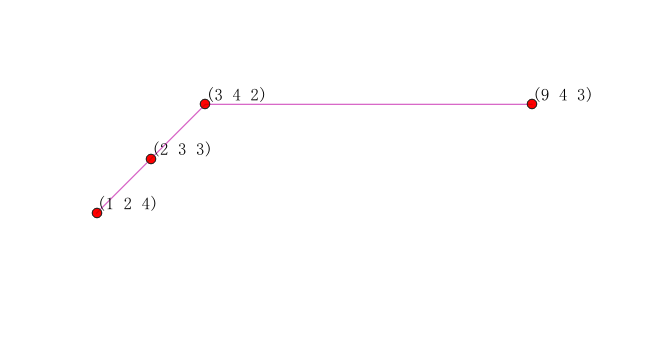
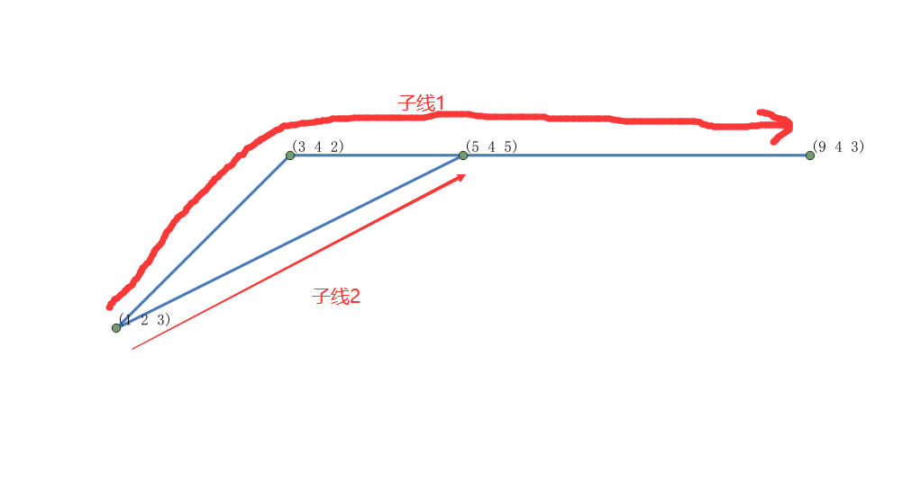
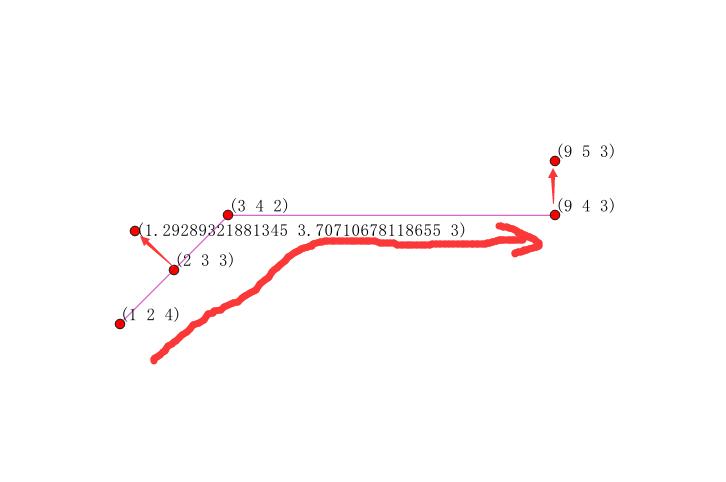
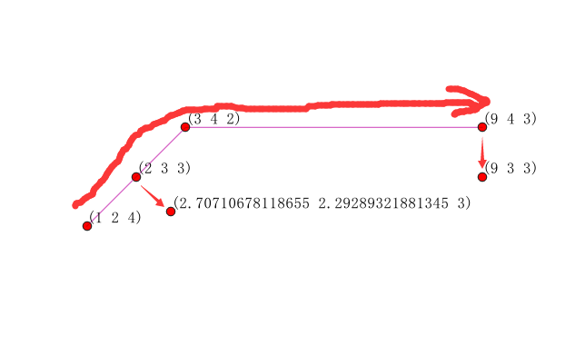
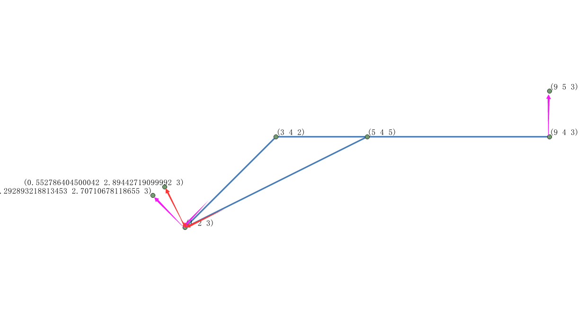

## ST_LocateAlong
### 方法功能描述
已知一个非面的带M值的图形，输入任意一个M测量值，返回该M值对应的地理位置集合形成的一个图形对象，返回图形都是MULTIPOINTM类型。

### 函数定义
1. 不输入偏移量：

```
geometry ST_LocateAlong(geometry ageom_with_measure, float8 a_measure);

```
2. 输入偏移量：

```
geometry ST_LocateAlong(geometry ageom_with_measure, float8 a_measure, float8 offset);
```
参数定义：

ageom_with_measure：必须是POINTM，MULTIPOINTM，LINESTRINGM，MULTILINESTRINGM类型之一，不支持面数据。POINTM只有单个点其实没啥意义，实际可用类型就MULTIPOINTM，LINESTRINGM，MULTILINESTRINGM三种类型，实用类型通常就LINESTRINGM一种情况。

a_measure：测量值数值。

offset：偏移量，意思是生成后的图形相对于原来图形进行偏移，正值是代表生成后的图形相当于原来图形左偏移，负值是相当于原来图形右偏移。

函数定义和说明非常非常抽象！！！

**使用限制：该函数有且仅适用于带测量值M的非面状图形计算。**

### 应用示例
1. 简单线型



```
SELECT ST_AsText(the_geom)
FROM
(SELECT ST_LocateAlong(
ST_GeomFromText('LINESTRINGM(1 2 4, 3 4 2, 9 4 3)'),3) As the_geom) As foo;
st_astext
-----------
MULTIPOINT M (2 3 3,9 4 3)
```
2. 多义线型


```
SELECT ST_AsText(the_geom)
FROM (SELECT ST_LocateAlong(
ST_GeomFromText('MULTILINESTRINGM((1 2 3, 3 4 2, 9 4 3),(1 2 3,5 4 5))'),3) As the_geom) As foo;
st_astext
--------------------------------
MULTIPOINT M (1 2 3,9 4 3,1 2 3)
```
结果出现了两个（1 2 3）点，原因是上图MULTILINESTRINGM由子线1,2组成的，在计算时，实际会将多义线拆分成单义线，每条线单独计算，从子线1得到 （1 2 3），（9 4 3）两个点，从子线2得到（1 2 3）一个点，合计得到3个点。
3. 多义点类型

```
SELECT ST_AsText(the_geom)
FROM (SELECT ST_LocateAlong(
ST_GeomFromText('MULTIPointM(1 2 3, 3 4 2, 9 4 3)'),3) As the_geom) As foo;
st_astext
--------------------------------
MULTIPOINT M (1 2 3,9 4 3)

SELECT ST_AsText(the_geom)
FROM (SELECT ST_LocateAlong(
ST_GeomFromText('MULTIPointM(1 2 3, 3 4 2, 9 4 3)'),2.3) As the_geom) As foo;
st_astext
--------------------------------
MULTIPOINT M EMPTY
```
多义点不会插值，m值只有“碰”到这个点的m值才行，不会插值，碰不到就返回空。
4. 单点类型

```
SELECT ST_AsText(the_geom)
FROM (SELECT ST_LocateAlong(
ST_GeomFromText('PointM(1 2 3)'),3) As the_geom) As foo;
     st_astext
---------------------
MULTIPOINT M (1 2 3)

SELECT ST_AsText(the_geom)
FROM (SELECT ST_LocateAlong(
ST_GeomFromText('MULTIPointM(1 2 3)'),2.3) As the_geom) As foo;
     st_astext
--------------------
MULTIPOINT M EMPTY
```
单点和多义点一样，不会插值，m值只有“碰”到这个点的m值才行，不会插值，碰不到就返回空。
5. 简单线型偏移值


```
--正向偏移
SELECT ST_AsText(the_geom)
FROM
(SELECT ST_LocateAlong(
ST_GeomFromText('LINESTRINGM(1 2 4, 3 4 2, 9 4 3)'),3,1) As the_geom) As foo;
st_astext
---------------------------------------------------------
MULTIPOINT M (1.29289321881345 3.70710678118655 3,9 5 3)
```
沿着单义线的前进方向，对原来的结果点向左偏移距离1，形成两个新的结果点。




```
--负向偏移
SELECT ST_AsText(the_geom)
FROM
(SELECT ST_LocateAlong(
ST_GeomFromText('LINESTRINGM(1 2 4, 3 4 2, 9 4 3)'),3,-1) As the_geom) As foo;
st_astext
---------------------------------------------------------
MULTIPOINT M (2.70710678118655 2.29289321881345 3,9 3 3)
```

6. 多义线型偏移值


```
SELECT ST_AsText(the_geom)
FROM (SELECT ST_LocateAlong(
ST_GeomFromText('MULTILINESTRINGM((1 2 3, 3 4 2, 9 4 3),(1 2 3,5 4 5))'),3,1) As the_geom) As foo;
st_astext
---------------------------------------------------------
MULTIPOINT M (0.292893218813453 2.70710678118655 3,9 5 3,0.552786404500042 2.89442719099992 3)
```
由图可知，即使偏移量，也是分别根据子线1，子线2分别做的偏移。红蓝箭头构成的直角框可知。