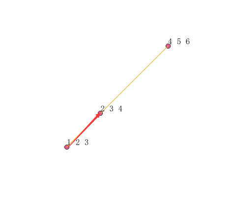
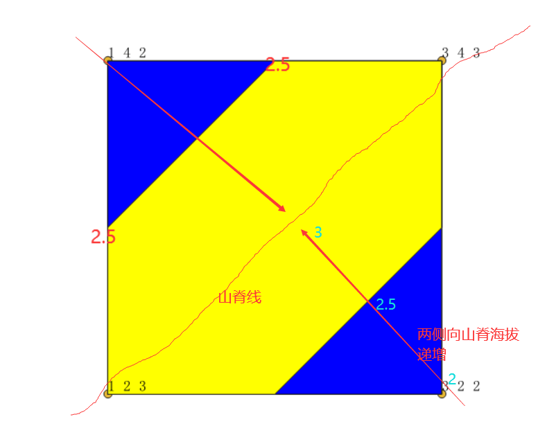

## ST_LocateBetweenElevations
### 方法功能描述
已知一个有高程值z的图形，设置一个起点，终点z值构成的区间，返回区间内的衍生图形集合。该函数与ST_LocateBetween本质一样，只是ST_LocateBetween是处理二维图形含测量值M的情况，计算方式是依据二维几何计算；ST_LocateBetweenElevations是处理三维图形含高程值Z的情况，计算方式是依据三维几何计算。

### 函数定义
```
geometry ST_LocateBetweenElevations(geometry geom, float8 elevation_start, float8 elevation_end);
```

参数定义：

    geom:输入的一个带有高程值z的图形。LineString，Polygon，TIN, TRIANGLE图形类型。
    elevation_start：起点海拔。
    elevation_end：终点海拔。

### 应用示例

1. LineString


```
SELECT ST_AsTexT(ST_LocateBetweenElevations(
ST_GeomFromText('LINESTRINGZ(1 2 3, 4 5 6)'), 2, 4)) As ewelev;
            ewelev
----------------------------------------------------------------
    MULTILINESTRING Z ((1 2 3,2 3 4))
```
2. Polygon

从一个高程面中查询高程值2.5到3之间的面区域。

```
SELECT ST_AsText(the_geom)
FROM (
SELECT ST_LocateBetweenElevations(
ST_GeomFromtext('POLYGONZ((1 2 3, 1 4 2, 3 4 3,3 2 2,1 2 3))'),
2.5,
3) as the_geom) As foo;
                            st_astext
-----------------------------------------------------------------------
MULTIPOLYGON Z (((1 2 3,1 3 2.5,2 4 2.5,3 4 3,3 3 2.5,2 2 2.5,1 2 3)))

```