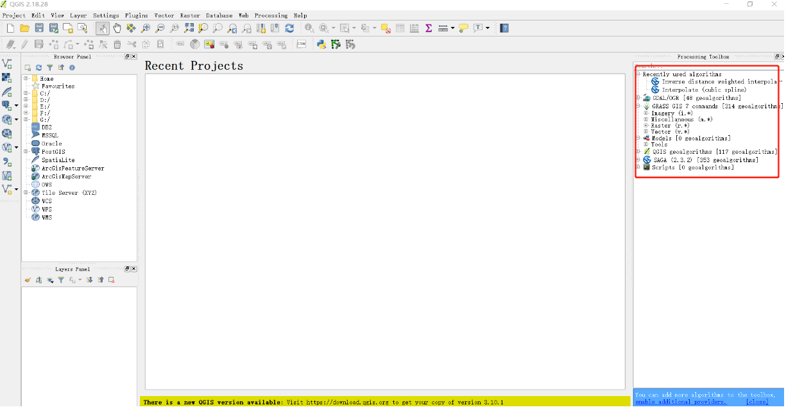
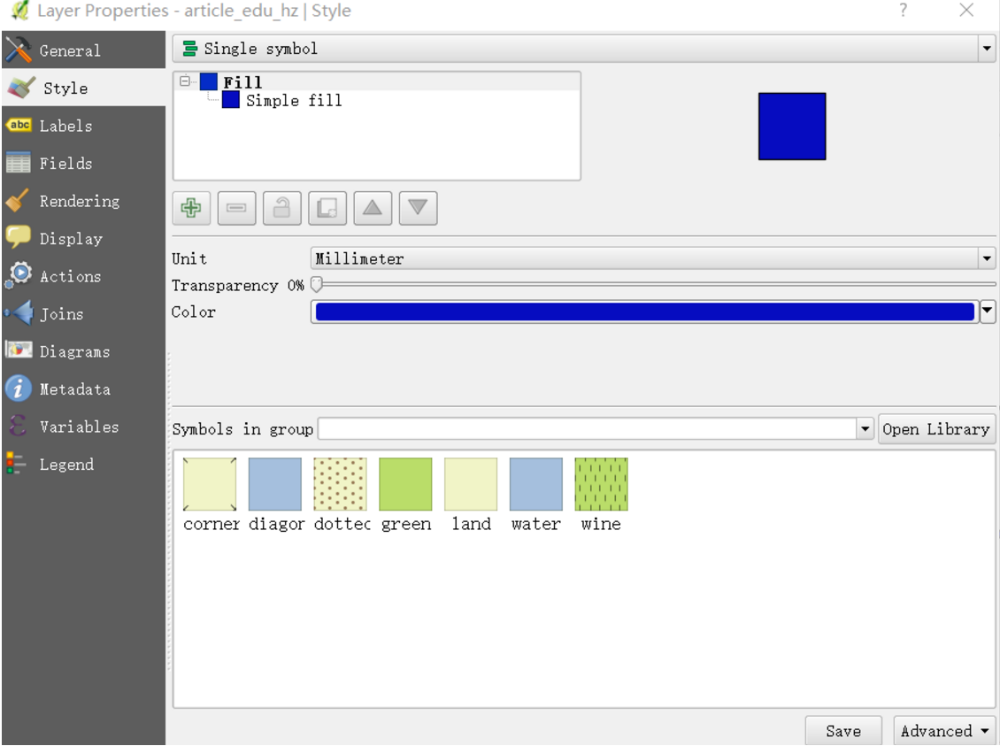
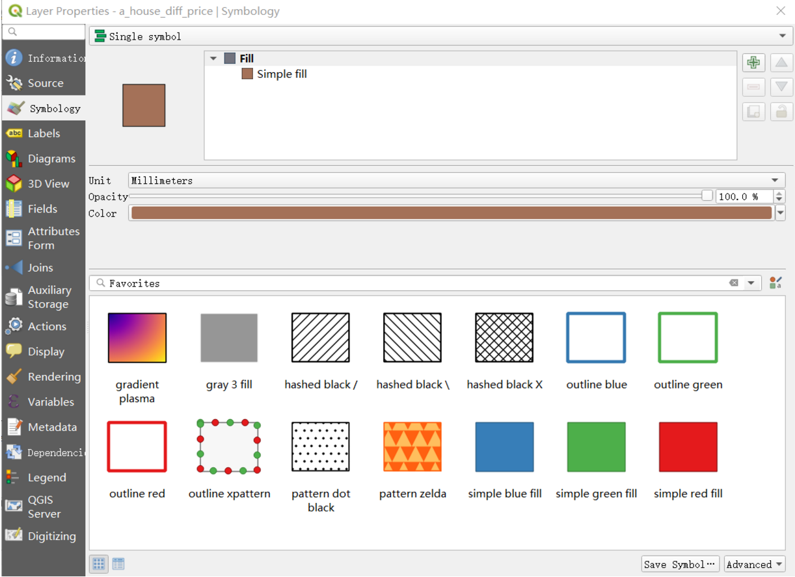
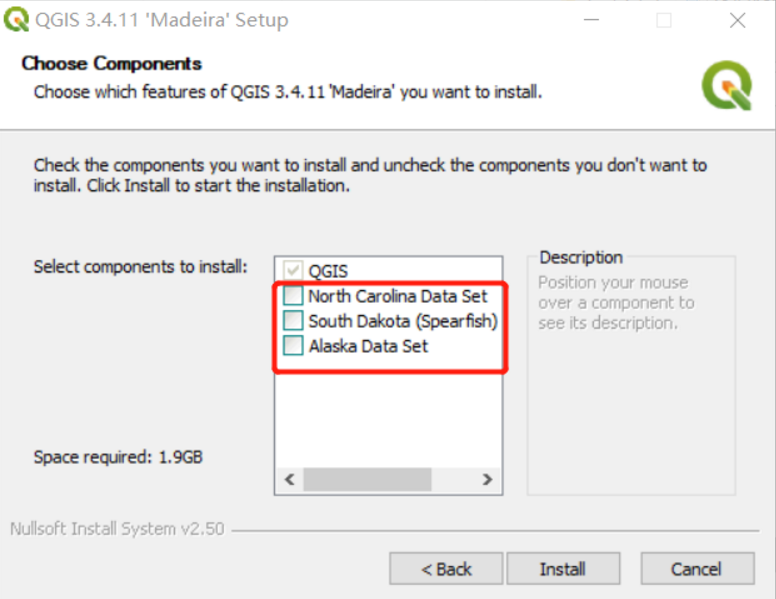

## QGIS介绍
> **工欲善其事，必先利其器**。既然学习postgis，那就不得不提一下qgis。为什么呢？postgis作为GIS的一个工具，而postgis本身不具备可视化的能力，所以必须找一个软件去补足postgis的短板。

> 在目前的gis软件中，qgis是对postgis支持度最好的一个GIS软件。虽然arcgis也对postgis进行支持，但arcgis和postgis配合的姿势估计不对，使用起来总是不给力。所以qgis和postgis还是配合起来最为默契的伙伴。

> qgis目前有两个系列，一个是2系列，一个是3系列。虽然qgis2系列仍然在迭代，但是它的更新也越来越慢，相对的qgis3的迭代则越来越快，目前2系列最新的版本是2.18，而3系列最新版本为3.10。

> 但是3系列存在一个一些菜单功能不可用的问题（系统为win10），无论是重装软件还是怎操作，都无效。所以目前本人的电脑都包含2个qgis，一个是2系列，一个是3系列。两个系列的软件，并不冲突，并且能够同时运行。至于为什么3系列有问题还要用呢？实在是3系列的软件对界面、符号等功能都由于2系列，尤其是想做一张漂亮的地图时，3系列是首选。本人甚至为了使用3系列重装了一次电脑。搞GIS的应该明白，重装系统需要多大决心，因为这意味着一整天的时间需要待着电脑前安装软件。

### 一、qgis2与qgis3的区别
- 界面不一样，3系列比2系列界面更优。
- 符号系统，3系列比2系列样式更多。
- 对postgis的支持，3系列比2系列多一个反向输入的功能。
- 稳定性，2系列比3系列稳定很多，2系列基本没出过啥问题，3系列经常出一些小问题。
- 速度，3系列比2系列的计算更快，效率更高。
- 功能，3系列的功能逐渐开始超过2系列。

### 二、qgis2与qgis3界面对比

---

### 三、qgis2与qgis3样式对比

---

### 四、qgis2与qgis3的选择
- 如果只是配合postgis实验使用，选择2系列。
- 如果需要配置漂亮的地图，选择3系列。
- 如果需要进行空间分析，选择3系列。
- 如果电脑配置足够高，选择安装2个系列。

### 五、qgis安装
> 在windows安装qgis软件是比较容易的，每一步都选择下一步就行。唯一需要注意的是，在安装过程中一定记得不要选择获取样例数据，因为GIS数据下载速度会让你崩溃，估计小半天都无法安装完成。如下图：

### 六、总结
> 工欲善其事，必先利其器。想学好postgis,就有必要安装一下qgis。qgis也是一个很有意思的软件，若得空，也是可以写一个qgis的使用手册。而在下一节中，将写一写qgis与postgis配合使用的方法。
