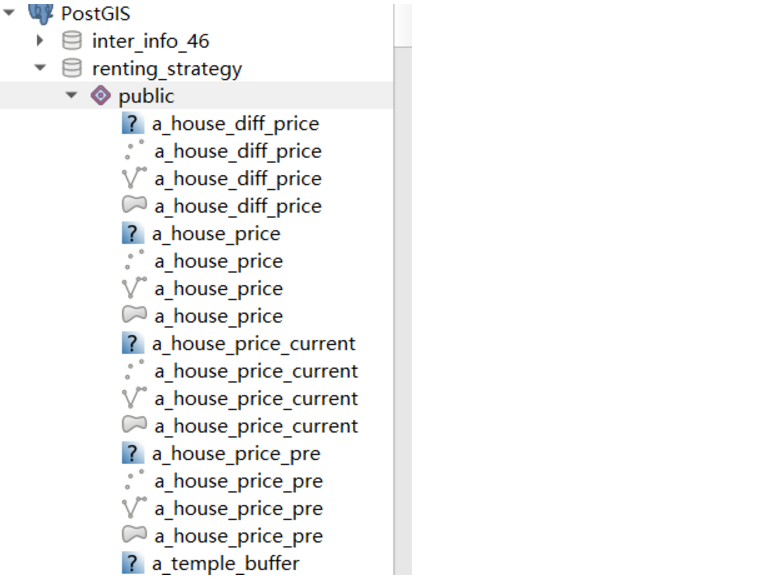

## QGIS与postgis结合使用介绍

> 前面小节介绍了qgis软件，也埋下一个引子，开了一个qgis与postgis结合的头。而在这一小节将给大家展示postgis与qgis配套使用方式。
### 一、postgis与qgis配合使用方式
- 显示postgresql表中的空间数据，整表显示。
- 显示由sql执行的结果数据，sqlview显示。
- 空间数据通过qgis导入postgresql（qgis3才具备这个功能）。

> 不管哪种使用方式，首先需要做的事就是将postgresql的连接信息配置到qgis中，和其他的数据库客户端一样，必须把数据库的连接信息配置进客户端。

### 二、qgis配置postgresql连接信息
1. **第一步右键postgis按钮，添加新的连接，如下图**：

2. **第二步填写postgresql连接信息，如下图：**
> ps:记住一定得记住保存密码和用户，选择store。不然每次使用都需要重新输入账户名和密码。

3. **第三步 若是配置成功，就能有如下图列表。**
> 在列表中能看到所有包含空间字段的表，双击就能将图层添加到qgis当中。

### 三、qgis与postgis配和方法
### 1、qgis与postgis配合使用第一种方式--整表显示
> 这种方式比较基础，直接双击显示就行，和普通的图层操作没有多大区别。但是若一个表中有多个空间字段，在qgis中会显示成多个图层，如下图。

### 2、qgis与postgis配合使用第二种方式--sqlview显示
> 这种方式是postgis使用过程中比较常见的一种使用方式。因为与传统的sql不同，空间sql写出来，到底符不符合自己的想法，需要看到具体的图形才知道。要实现这个功能，需要使用qgis>database功能，如下图：

选中sql需要执行的数据库，如下图：

创建sql window,如下图。在此窗口就能写你的空间查询sql了。

若你写的sql是正确的，你就能将结果数据显示在qgis上了，如下图。注意：此处一定得选择需要加装的空间字段，在这个功能中默认加装字段名为geom的空间字段。其他名字的空间字段则需要手动选择。

### 3、qgis与postgis配合使用第三种方式--sqlview显示（qgis3特有的）
> 这种方式主要是将qgis中的图层导入到postgresql的功能。如下图。在这个功能中，能够选择需要导入的图层，以及导入的数据库。

### 四、总结
在这小节中向大家展示了qgis与postgis配合使用的三种方式。使用这三种方式，大家借助sql语句，能够更容易的实现空间查询，甚至很多复杂的空间分析功能。