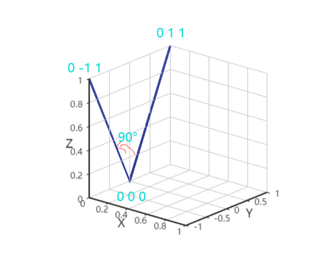

## ST_RotateX
### 方法功能描述
对输入图形围绕x轴旋转一定角度（弧度制），输出一个旋转后的新图形。
### 函数定义

```
geometry ST_RotateX(geometry geomA, float rotRadians);
```
参数说明：
    
    geomA:输入图形。
    rotRadians：绕x轴旋转角度，方向为逆时针方向。
### 应用示例
为方便展示，把x轴坐标统一写0，即将xyz三维，降维到yz二维，方便读者理解。（三维人脑不好理解）。

示例：对已知线LINESTRING(0 0 0, 0 1 1)围绕x轴旋转90度。


```
SELECT ST_AsEWKT(ST_RotateX(ST_GeomFromEWKT('LINESTRINGZ(0 0 0, 0 1 1)'), pi()/2));
    st_asewkt
------------------------------
LINESTRINGZ(0 0 0,0 -1 1)
```

**说明:ST_RotateX(geomA, rotRadians)是ST_Affine(geomA, 1, 0, 0, 0,cos(rotRadians), -sin(rotRadians), 0, sin(rotRadians), cos(rotRadians), 0,0, 0)的缩写，是围绕x轴旋转场景下的一种封装和应用简化。**