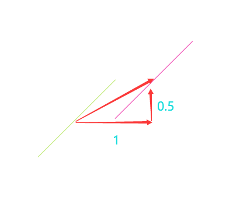

## ST_Translate
### 方法功能描述
根所设置的偏移量，对输入图形进行坐标平移，返回一个新的平移后的图形。

### 函数定义
二维：

```
geometry ST_Translate(geometry g1, float deltax, float deltay);
```


三维：

```
geometry ST_Translate(geometry g1, float deltax, float deltay, float deltaz);
```
### 应用示例


二维：

```
select st_astext(geom) geom1,st_astext(ST_Translate(geom, 1, 0.5)) geom2 
from (SELECT ST_GeomFromEWKT('LINESTRING(118 32, 119 33)') As geom) as foo;
          geom1           |           geom2
---------------------------------------------------------
LINESTRING(118 32,119 33) | LINESTRING(119 32.5,120 33.5)
```
使用二维的ST_Affine，等同于对三维的z不处理，如下：

```
select st_astext(geom) geom1,st_astext(ST_Translate(geom, 1, 0.5)) geom2 
from (SELECT ST_GeomFromEWKT('LINESTRING(118 32 10, 119 33 20)') As geom) as foo;
          geom1           |           geom2
---------------------------------------------------------
LINESTRING(118 32 10,119 33 10) | LINESTRING(119 32.5 10,120 33.5 20)
```
**z轴没有发生任何变化。**


三维：

```
select st_astext(geom) geom1,st_astext(ST_Translate(geom, 1, 0.5,-1)) geom2 
from (SELECT ST_GeomFromEWKT('LINESTRING(118 32 10, 119 33 20)') As geom) as foo;
          geom1           |           geom2
---------------------------------------------------------
LINESTRING(118 32 10,119 33 10) | LINESTRING Z (119 32.5 9,120 33.5 19)
```
**z轴都减少了1。**


**结论：ST_Translate是ST_Affine平移场景的封装和简化写法。**