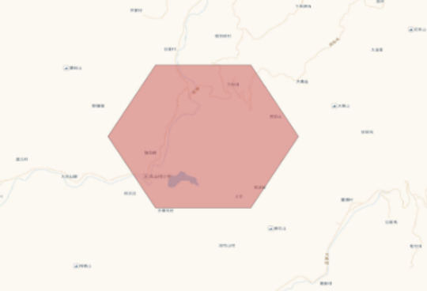
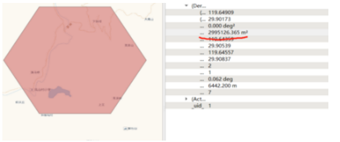

## ST_Area 
### 一、 方法功能描述
返回输入对象是polygon或者multi-polygon对象的面积。对于geometry对象来说，面积单位是SRID规定的单位，对于geography对象，面积是平方米。

### 二、用法
- float ST_Area(geometry g1);
- float ST_Area(geography geog, boolean use_spheroid=true);


### 三、描述
返回输入对象是polygon或者multi-polygon对象的面积。对于geometry对象
来说，面积单位是SRID规定的单位，对于geography对象，面积是平方米。默认计算的是大地坐标系（目前只有WGS84）的
下的面积。如果想要计算更快但精度略低，需要计算球面积。使用方法如下：ST_Area(geog,false).


### 四、应用示例
> 借助ST_Area测量下图中的六边形的网格面积



###### 第一个示例，不经过坐标转换，在4326坐标系下的计算
> 此示例借助了构造空间对象函数st_geomfromtext构造六边形

```
SELECT
	st_area (
	st_geomfromtext ( 'POLYGON((119.640001091388 29.899998120498,119.645570646149 29.9083692949019,119.656709755673 29.9083692949019,119.662279310434 29.899998120498,119.656709755673 29.8916262427405,119.645570646149 29.8916262427405,119.640001091388 29.899998120498))', 4326 ))
--结果
--0.000279754037671141
```
###### 第二个示例，将坐标系4236转换成3857坐标系下的计算
> 此示例使用了st_geomfromtext函数构造空间对象和st_transform函数进行坐标转换

```
SELECT
	st_area (
	st_transform(st_geomfromtext ( 'POLYGON((119.640001091388 29.899998120498,119.645570646149 29.9083692949019,119.656709755673 29.9083692949019,119.662279310434 29.899998120498,119.656709755673 29.8916262427405,119.645570646149 29.8916262427405,119.640001091388 29.899998120498))', 4326 ),3857))
	
--结果
--3999000.0000913
```


###### 第三个示例，将geometry转换成geography对象进行计算
> 此示例使用了st_geomfromtext函数构造空间对象和并将geometry对象转成geography对象

```
--进行球面面积进行计算
SELECT
	st_area (
	st_geomfromtext ( 'POLYGON((119.640001091388 29.899998120498,119.645570646149 29.9083692949019,119.656709755673 29.9083692949019,119.662279310434 29.899998120498,119.656709755673 29.8916262427405,119.645570646149 29.8916262427405,119.640001091388 29.899998120498))', 4326 )::geography，true)
	
--结果
--2995126.37230301
```

###### 第四个示例，将geometry转换成geography对象进行计算，并设置不启动球面计算
> 此示例使用了st_geomfromtext函数构造空间对象和并将geometry对象转成geography对象

```
--进行球面计算，但是精度稍微低一点，但是计算速度更快
SELECT
	st_area (
	st_geomfromtext ( 'POLYGON((119.640001091388 29.899998120498,119.645570646149 29.9083692949019,119.656709755673 29.9083692949019,119.662279310434 29.899998120498,119.656709755673 29.8916262427405,119.645570646149 29.8916262427405,119.640001091388 29.899998120498))', 4326 )::geography,false)
--结果
--2998574.90307443
```

### 五、总结
> 借助qgis对上述的六边形进行面积测量，测量结果如下图所示。


> 从上图来看，精度对比如下：
st_area(geom::geography)>st_area(geom::geography，false)>st_area(st_transform(geom,3567)) >st_area(geom) 
  st_area(geom::geography)的计算结果基本和qgis的量测结果一致。

> 此外ST_Area(geography geog, boolean use_spheroid=true)中的use_spheroid参数，官网文档标识设置为false,会降低精度，但是能够提高计算速度。但是实验结果并不是一定是这样的，计算效率会有偏差，所以需要根据自己的数据，参考的设置这个参数。
