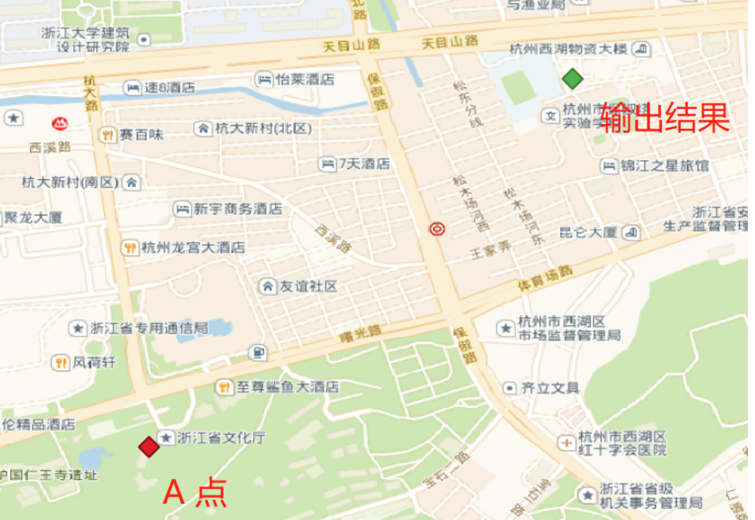
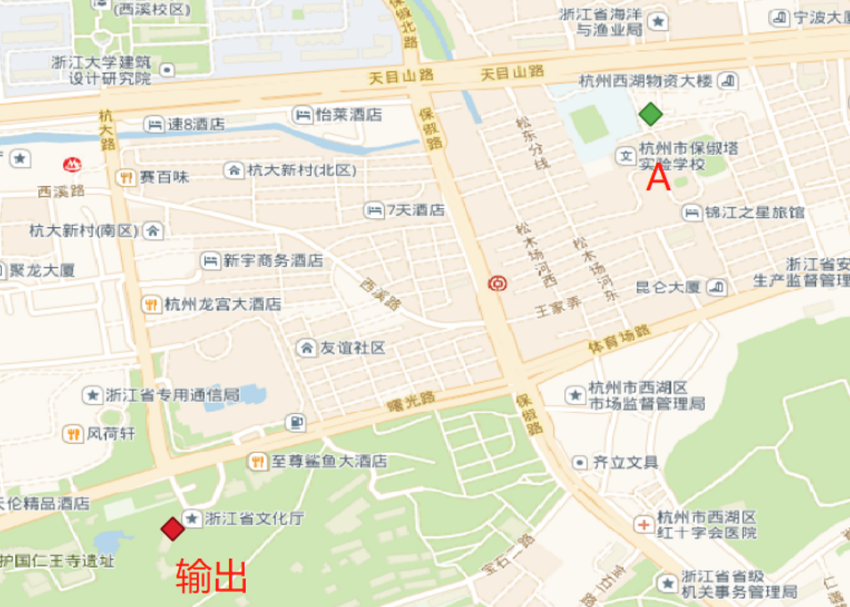

### 一、方法功能描述
> 该方法根据输入的距离和角度（方位角，与正北方的夹角），返回起点沿着测地线的投影点。可以理解为根据角度和距离进行点的移动。
### 二、函数定义
1. 该函数有三种执行方式
```
geography ST_Project(geography g1, float distance, float azimuth);
```
参数定义：
```
- g1 geography 点
- distance 距离，单位米
- azimuth 方位角 弧度。
方位角（也称为航向或方位角）以弧度表示。从真北（方位角零）顺时针测量。
East是方位角π/ 2（90度）；
南是方位角π（180度）; 
西方是方位角3π/ 2（270度）。
支持负方位角值和大于2π（360度）的值。
```

### 三、应用示例

###### 计算A点空间关系外：距离1000米，方位角45度的点

```
with test_table as (select 
st_geomfromtext('POINT(120.142 30.265)',4326) as pointA
)
select st_distance(geom,pointA) , 
degrees(ST_Azimuth(pointa,geom)),
st_astext(geom) as geom,
st_astext(pointa) as pointa
from (
select 
ST_Project(pointA::geography,1000,radians(45.0)) as geom,
pointA from test_table
) k

st_distance | degrees | geom | pointa
-----------
    1000 |	44.9999999999595 |	POINT(120.149348650153 30.271378344056) |	POINT(120.142 30.265)
(1 row)
```


###### 计算A点空间关系外：距离-1000米，方位角45度的点
> 距离为负数代表着该在方位角方向的方向延长线上取值。但是负值功能只在postgis2.4版本以后可以使用。

```
with test_table as (select 
st_geomfromtext('POINT(120.142 30.265)',4326) as pointA
)
select st_distance(geom,pointA) , 
degrees(ST_Azimuth(pointa,geom)),
st_astext(geom) as geom,
st_astext(pointa) as pointa
from (
select 
ST_Project(pointA::geography,-1000,radians(45.0)) as geom,
pointA from test_table
) k;

st_distance | degrees | geom | pointa
-----------
    1000 |	-135.000000000055 |	POINT(120.134652299788 30.2586212374289) |	POINT(120.142 30.265)
(1 row)
```



### 总结
> ST_Project函数是一个非常有用的函数，该函数能够将一个点按照一定的角度和距离进行移动。在一些场景使用该函数特别有价值，比如根据角度生成射线的需求；以某点为圆心生成环绕它的点（圆周上）。